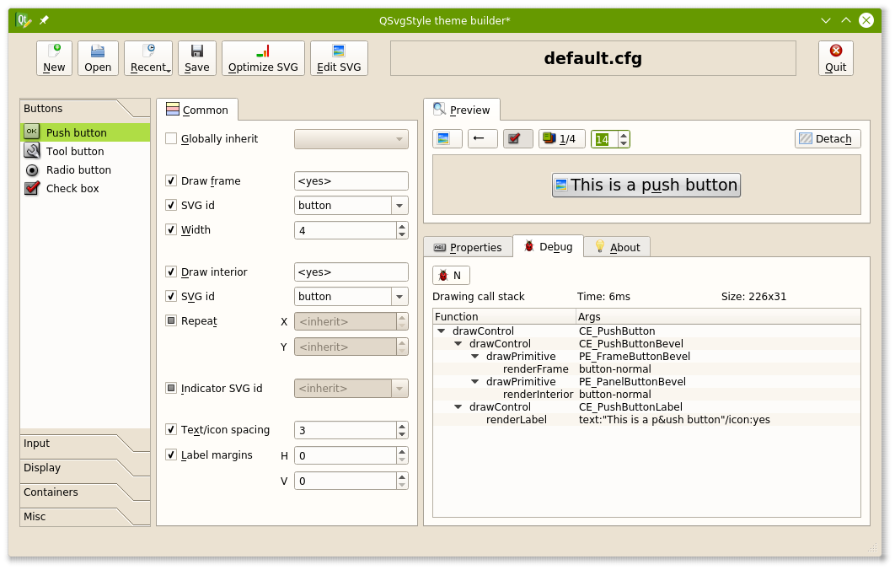

# QSvgStyle

QSvgStyle is a themeable SVG style for Qt 4 and Qt 5 applications
(C) Said LANKRI, under the GNU GPL License version 2+

It comes with the style (QSvgStyle), a theme builder (QSvgThemeBuilder)
and a built-in svg cleaner courtesy of SVGCleaner team.

# Compile

You need Qt4 or Qt5 development files

```
$ qmake
$ make
```

If you have both Qt4 and Qt5 installed on your system, you can add `-qt=4`
or `-qt=5` to the `qmake` line.

# Install

## With root access

copy or symlink the `libqsvgstyle.so` library to the plugins directory of Qt:

* Qt4

```
$ cd /usr/lib/qt4/plugins/styles
$ cp /path/to/QSvgStyle/style/plugins/libqsvgstyle.so .
```

* Qt5
```
$ cd /usr/lib/x86_64-linux-gnu/qt5/plugins/styles
$ cp /path/to/QSvgStyle/style/plugins/libqsvgstyle.so .
```

*NOTE* These paths are given as an example and may depend on your distribution

## Wihout root access

You need to adjust the `QT_PLUGIN_PATH` variable so it includes the location
of QSvgStyle library.

```
$ export QT_PLUGIN_PATH=$QT_PLUGIN_PATH:/path/to/QSvgStyle/style/plugins
```

*Warning* This setting is local to your terminal.

# Testing

You can run any Qt4/Qt5 application with QSvgStyle by adding a `-style` option:

```
$ kwrite -style qsvgstyle
```

If you want to set QSvgStyle as the default style for all Qt applications,
run the `qtconfig` tool and select it.

*Note* In order for QSvgStyle to appear in the list, it must be installed
as root (see above)

# Theme selection

QSvgStyle already comes with a default built-in theme courtesy of Richard Kung.
This theme will be used by default unless another theme is explicitly set.

To change the theme, follow these steps:

```
$ mkdir ~/.config/QSvgStyle
$ cd ~/.config/QSvgStyle
$ echo "theme=your_theme_name" > qsvgstyle.cfg
```

A matching `your_theme_name` directory must be present inside `~/.config/QSvgStyle`,
containing both `your_theme_name.svg` and `your_theme_name.cfg`. The
QSvgThemeBuilder tool can setup this for you (see below)

# Theme building with QSvgThemeBuilder

QSvgStyle comes with a nice GUI that helps building themes.
It can generate both an initial SVG file and its companion config file.

Run the theme builder as follows:

```
$ path/to/QSvgStyle/themebuilder/bin/qsvgthemebuilder
```



Use `New` theme button to create a new theme based on the default theme.

You can now open the corresponding SVG file on your favorite SVG editor and
work on it.

QSvgThemeBuilder shows live preview of your theme while you make changes to
the SVG file. You can adjust all the settings supported by QSvgStyle engine.

See above for how to make your new theme the default QSvgStyle theme.

We recommend that you optimize your SVG file once you have finished editing the
SVG file. This will result in smaller files and less memory footprint.
