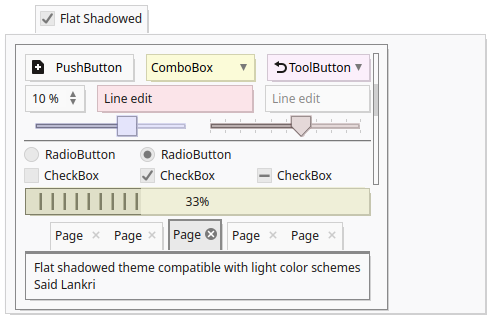

# QSvgStyle distribution

QSvgStyle is a themeable SVG style for Qt 6 desktop applications
(C) Said LANKRI, under the GNU GPL License version 2+

It comes with the style engine (QSvgStyle), a theme builder (QSvgThemeBuilder),
 a theme manager (QSvgThemeManager), a built-in svg cleaner courtesy of
 SVGCleaner team and a set of themes.
 
Works on Linux and Windows with MSYS2.

- FlatShadowed: Official QSvgStyle theme and our best light theme with 
outstanding support for widget color palettes.




- Godot2: a port of the Godot2 game engine dark theme


- Godot2 Catppuccin Latte: Godot2 with Catppuccin's Latte color scheme


- Windows11 Light Seafoam


## QSvgStyle
- Themeable Qt6 style engine using standard SVG documents as themes
- Fast rendering. QSvgStyle renders at the speed of a raster engine, which
  is at least twice faster than the Qt SVG renderer
- Support for color schemes. The theme can be configured to apply the current
  color scheme on top of the rendered theme
- Support for Widget palettes. QSvgStyle will honour any QPalette set on a widget
- Complete support for Right-to-Left layouts
- Support for capsule grouping in buttons
- Support for variants for some widgets
- Built-in default theme
- Cleanest QStyle engine code with regular code patterns

## QSvgThemeBuilder
- Easy to use GUI tool to build configuration files for themes, with support
  for multiple preview variants, RTL layouts, enabled/disabled states and others
- Live configuration previews. Any changes made to the settings are
  immediately effective in the preview area
- Live SVG previews. Any changes externally made to the SVG theme are
  immediately effective in the preview area
- Inheritance system. A widget can inherit the settings of another
  one, as such settings are limited to the differences and configuration
  files are kept to minimal size
- Display of effective values. When a setting is inherited, the effective
  value is computed and shown in the GUI
- Unique debugging tool to see the Qt rendering internals and detect missing
  SVG elements in the theme
- Basic SVG generator. Use the built-in SVG generator to generate
  accurate frames, interiors and shadows to be exported to your favorite SVG
  editing tool for a faster theme making workflow
- Built-in SVG cleaner. Use the cleaner to reduce the size of your SVG file
  by a half or more

## QSvgThemeManager
- Select the active QSvgStyle theme to apply
- Live preview of themes

# Build the source

## Prerequisites

You need the Qt6 development files of the following modules to compile QSvgStyle:
- Qt Base
- Qt SVG
- Qt5 Compatibility module

On Windows, you also need the MSYS2 distribution which you can get using its
installer [HERE](https://www.msys2.org/)

For debian based systems:

```bash
sudo apt install qt6-base-dev qt6-svg-dev qt6-5compat-dev
```

For Windows MSYS2, open an UCRT64 terminal:

```bash
pacman -S \
  mingw-w64-ucrt-x86_64-make \
  mingw-w64-ucrt-x86_64-gcc \
  mingw-w64-ucrt-x86_64-qt6-base \
  mingw-w64-ucrt-x86_64-qt6-svg \
  mingw-w64-ucrt-x86_64-qt6-5compat
```

## Build

```bash
mkdir -p build/release
cd build/release
qmake6 ../..
$ make -j
```

## Install

Linux:

```bash
sudo make install
```

Windows:

```bash
make install
```

## Use

You can launch any Qt6 application with QSvgStyle styling by adding a `-style` option:

```
dolphin -style qsvgstyle
```

To globally set QSvgStyle as your default style engine, use your favorite
desktop's configuration tool. For example, use the System Settings in KDE.

# QSvgThemeManager: chose theme and tweak the engine

QSvgStyle will use its built-in theme when no particular theme has been chosen.
To choose a theme, use the QSvgThemeManager application.

```
$ qsvgthememanager
```

- Choose the active theme and tweak the engine


# QSvgThemeBuilder: build theme configuration

QSvgStyle comes with a nice GUI that helps building themes.
It can generate both an initial SVG file based on the default theme and its
companion config file.

```
$ qsvgthemebuilder
```

- Editing configuration


- Debugging


- Quick SVG generator to generate SVG items with frames, interiors and shadows
  with many generation options


- Export to SVG editing application of accurate, clean and minimal SVG data with
  given SVG ids


# Documentation

The latest documentation is always available at [Read The Docs](http://qsvgstyle.readthedocs.io/en/latest)

# Credits

QSvgStyle uses software from [QuaZip](https://github.com/stachenov/quazip) and [SVGCleaner](https://github.com/RazrFalcon/svgcleaner/tree/b827305).

