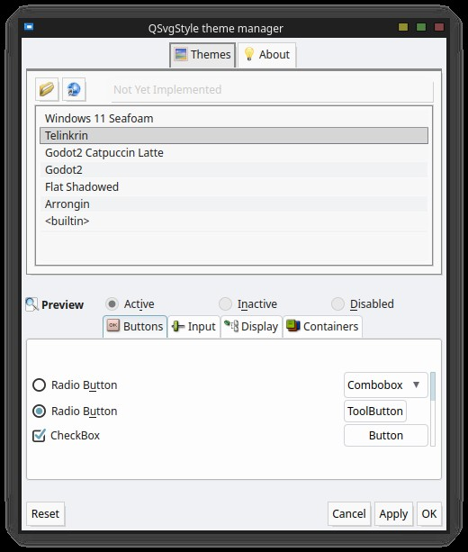
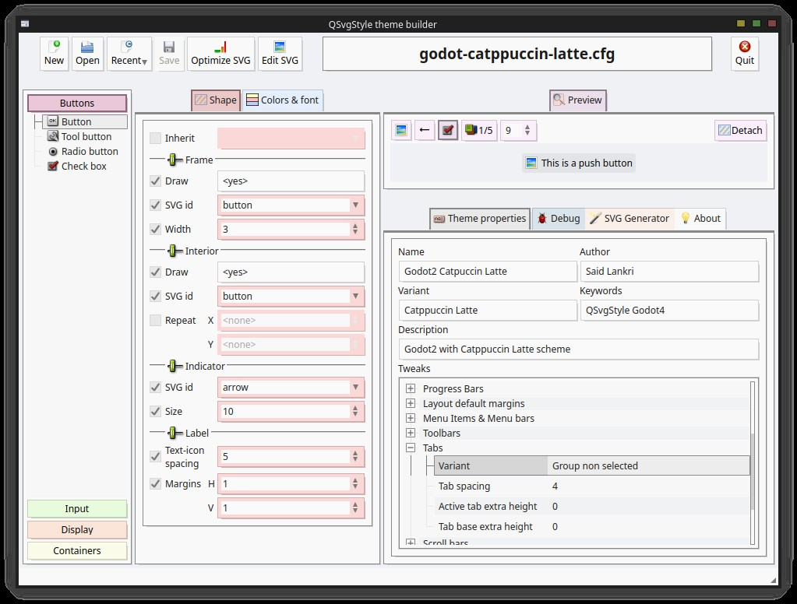

|Linux Build Status|Documentation Build Status|Coverity Scan Build Status|
|:--:|:--:|:--:|
|[](https://travis-ci.org/DexterMagnific/QSvgStyle)|[](http://qsvgstyle.readthedocs.io/en/latest/?badge=latest)|[](https://scan.coverity.com/projects/15379)|

# QSvgStyle distribution

QSvgStyle is a themeable SVG style for Qt 5 desktop applications
(C) Said LANKRI, under the GNU GPL License version 2+

It comes with the style engine (QSvgStyle), a theme builder (QSvgThemeBuilder),
 a theme manager (QSvgThemeManager) and a built-in svg cleaner courtesy of
 SVGCleaner team.

## QSvgStyle
- Themeable Qt5 style engine using standard SVG documents as themes
- Fast rendering. QSvgStyle renders at the speed of a raster engine, which
  is at least twice faster than the Qt SVG renderer
- Support for color schemes. The theme can be configured to apply the current
  color scheme on top of the rendered theme
- Support for Widget palettes. QSvgStyle will honour any QPalette set on a widget
- Complete support for Right-to-Left layouts
- Support for capsule grouping in buttons
- Support for variants for some widgets
- Built-in default theme
- Cleanest QStyle engine code with regular code patterns

## QSvgThemeBuilder
- Easy to use GUI tool to build configuration files for themes, with support
  for multiple preview variants, RTL layouts, enabled/disabled states and others
- Live configuration previews. Any changes made to the settings are
  immediately effective in the preview area
- Live SVG previews. Any changes externally made to the SVG theme are
  immediately effective in the preview area
- Inheritance system. A widget can inherit the settings of another
  one, as such settings are limited to the differences and configuration
  files are kept to minimal size
- Display of effective values. When a setting is inherited, the effective
  value is computed and shown in the GUI
- Unique debugging tool to see the Qt rendering internals and detect missing
  SVG elements in the theme
- Basic SVG generator. Use the built-in SVG generator to generate
  accurate frames, interiors and shadows to be exported to your favorite SVG
  editing tool for a faster theme making workflow
- Built-in SVG cleaner. Use the cleaner to reduce the size of your SVG file
  by a half or more

## QSvgThemeManager
- Select the active QSvgStyle theme to apply
- Download online themes
- Live preview of themes

# Binary builds

Binary builds are provided for few distributions. If you want to contribute,
please send me an email.

## Ubuntu Artful/Bionic

Binary packages are provided on PPA for both i386 and xx86_64
architectures for Ubuntu Artful and Bionic

```
  sudo add-apt-repository ppa:dextermagnific/ppa
  sudo apt update
  sudo apt install qt-style-qsvgstyle-qt5
```

# Build the source

## Compile

You need the Qt5 development files of the following modules to compile QSvgStyle:
- Qt Core
- Qt GUI
- Qt SVG
- Qt XML

```
$ qmake -qt=5
$ make
```

## Install

```
$ sudo make install
```

## Use

You can locally make any Qt5 application use QSvgStyle by adding a `-style` option:

```
$ dolphin -style qsvgstyle
```

To globally set QSvgStyle as your default style engine, use your favorite
desktop's configuration tool. For example, use the systemsettings5 in KDE.

# QSvgThemeManager: chose theme and tweak the engine

QSvgStyle will use its built-in theme when no particular theme has been chosen.
To choose a theme, use the QSvgThemeManager application.

```
$ qsvgthememanager
```

- Choose the active theme and tweak the engine


# QSvgThemeBuilder: build theme configuration

QSvgStyle comes with a nice GUI that helps building themes.
It can generate both an initial SVG file based on the default theme and its
companion config file.


```
$ qsvgthemebuilder
```

- QSvgThemeBuilder at startup


- Editing configuration for a flat theme


- Showing effective values of inherited settings


- Quick SVG generator to generate SVG items with frames, interiors and shadows
  with many generation options


- Export to SVG editing application of accurate, clean and minimal SVG data with
  given SVG ids


# Documentation

The latest documentation is always available at [Read The Docs](http://qsvgstyle.readthedocs.io/en/latest)
