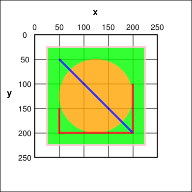
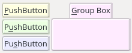
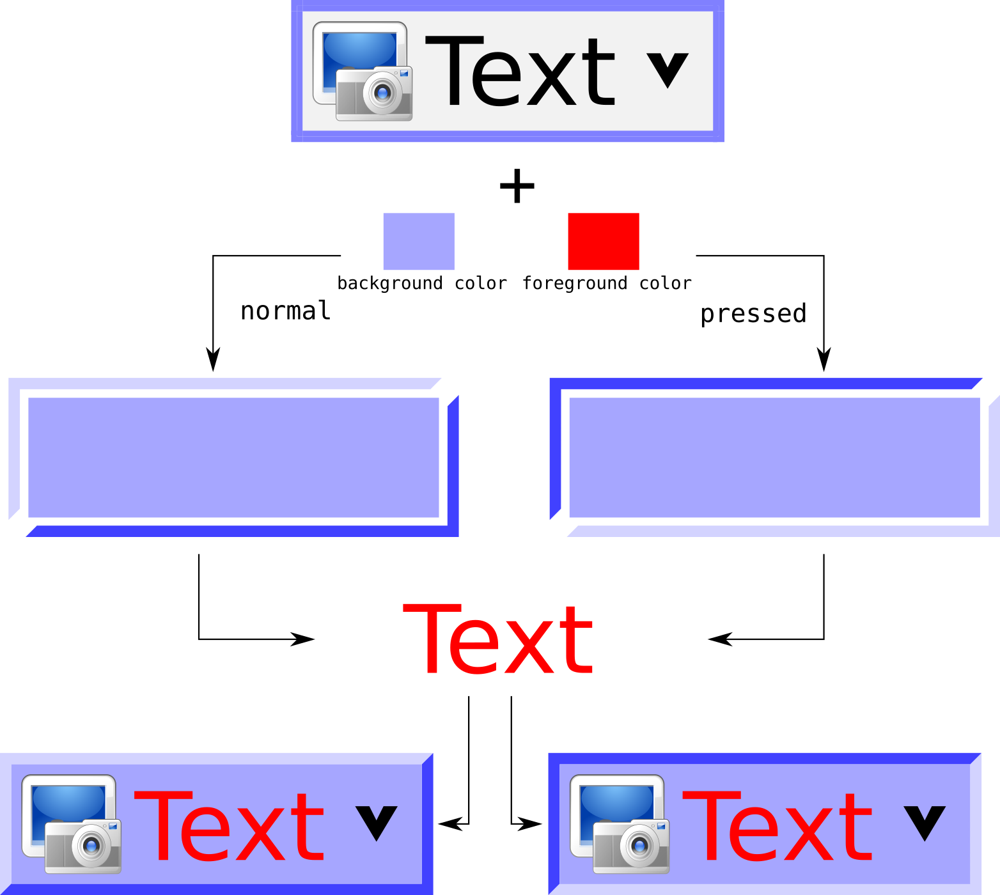
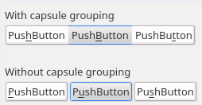
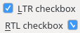
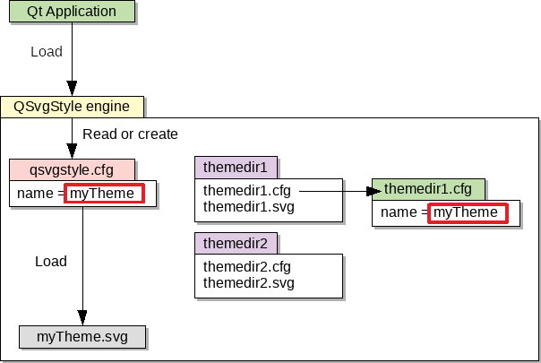
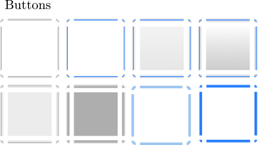
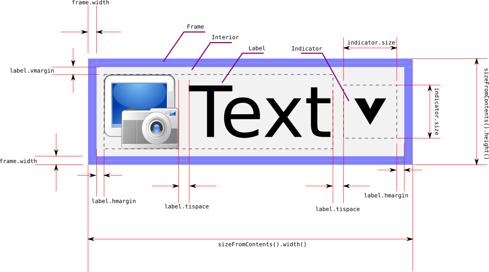
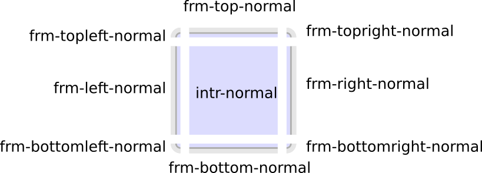
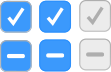

.. highlight:: shell

QSvgStyle Engine
================

Overview
--------

The **QSvgStyle Engine** is a :ref:`Style Engine <style-engines>` for
Qt_ desktop applications that allows you to change the appearance of
Qt5 applications using :ref:`SVG themes <svg-theme>`

Refer to :ref:`quick-start` for compile, run and test instructions

.. _Qt: https://qt.io

Feature Summary
~~~~~~~~~~~~~~~

- :ref:`Themes <svg-theme>`: Change the appearance of Qt5 applications
  without any programming knowledge.
- :ref:`Fast rendering <fast-render>`: Fast rendering. QSvgStyle renders
  at the speed of a raster engine, which is at least twice faster than
  the SVG rendering.
- :ref:`Inheritance system <inheritance>`: Keeps theme configuration
  files to a strictly minimal size 
- :ref:`Palette support <qpalette-support>`: your current desktop
  color scheme can be applied on top of the rendered theme, as well as
  any QPalette set on a widget.
- :ref:`Capsule grouping <capsule-grouping>`: buttons can be laid out
  in *capsules*.
- :ref:`Variant support <variants>`: the arrangement of some complex
  widgets can be tuned
- :ref:`RTL support <rtl-support>`: complete support for Right to Left layouts
- Animated busy progress bars
- Built-in default theme

.. _style-engines:

Style Engines
~~~~~~~~~~~~~

Qt style engines are written in C++ and come in the form of shared
libraries that are loaded by Qt applications. A style engine is the
component responsible of the appearance of Qt widgets, this includes
buttons, scroll bars, check boxes, ...

Qt already comes with style engines that mimic the native style of the
OS it is running on:

+-----------------------------------+--------------------------------------+
| .. figure:: images/qmacstyle.png  |  .. figure:: images/fusion-style.png |
|                                   |                                      |
|   Aqua Style on Mac OS            |   Fusion Style on Linux              |
|                                   |                                      |
+-----------------------------------+--------------------------------------+

There are also very few other style engines written by other people
around the web. Most famous ones are `QtCurve
<https://github.com/KDE/qtcurve>`_ and `KDE breeze
<https://github.com/KDE/breeze>`_.

Writing a Qt style engine is complicated and involves both good C++
and Qt knowledge. This is clearly not an acceptable way of tuning the
appearance of an application nowadays as there are many less
complicated ways of doing it at the reach of non programmers, such as
using CSS style sheets or a collection of images (a.k.a :ref:`themes
<svg-theme>`).

QSvgStyle (formerly QuantumStyle) is the first style engine that not
only allows non programmers (e.g. designers) to make themes, but also
the first style engine to use `Scalable Vector Graphics (SVG)
<https://en.wikipedia.org/wiki/Scalable_Vector_Graphics>`_ for its
themes.

.. note:: QSvgStyle is a pure Qt5 style engine. It does not depend on
          KDE libraries.

.. _svg-doc:

SVG documents
~~~~~~~~~~~~~

An SVG document is an XML based file format for storing
drawings. Unlike most formats that store pictures as pixel data
(raster, like PNG and JPEG) in a binary format, SVG documents store
drawings information as points and curves in clear text format.

Here is an example of an SVG file:

.. code-block:: xml

   <?xml version="1.0" encoding="UTF-8" ?>
   <svg xmlns="http://www.w3.org/2000/svg" version="1.1">
     <rect id="rect1" x="25" y="25" width="200" height="200" fill="lime" stroke-width="4" stroke="pink" />
     <circle id="circle1" cx="125" cy="125" r="75" fill="orange" />
     <polyline id="poly1" points="50,150 50,200 200,200 200,100" stroke="red" stroke-width="4" fill="none" />
     <line id="line" x1="50" y1="50" x2="200" y2="200" stroke="blue" stroke-width="4" />
   </svg>

And here is the rendered output (except the grid):

Such drawings are scalable, meaning that zooming does not lead to any
pixelization. Each time the drawing is scaled, points are relocated
accordingly and curves are recomputed. As a consequence,
SVG drawings are always smooth. For example, if you are designing an
icon set for your favorite desktop environment, you no longer need to
provide your set in different sizes if you design it in SVG.

Also note the ``id`` attribute. It is a mean of uniquely identifying
the SVG object. QSvgStyle engine uses the ``id`` attribute to retrieve
correct shapes to use for widgets.

See https://en.wikipedia.org/wiki/Scalable_Vector_Graphics for a
detailed description and examples.

Like for raster images, there are a number of applications used to
create SVG drawings, with variable support for the SVG standard and
also proprietary additions to it.

.. note:: QSvgStyle distribution does not supply a tool for creating
          SVG drawings

We recommend using Inkscape_, a very popular free and open source
vector drawing program. Themes created in Inkscape are correctly
rendered in Qt, this means that Qt will show the SVG document exactly
as you see it when creating it with Inkscape.

.. _Inkscape: http://www.inkscape.org

.. _files:

Files
-----

.. _global-config-file:

Global Configuration File
~~~~~~~~~~~~~~~~~~~~~~~~~

QSvgStyle engine uses a global configuration file per user located in::

  $ConfigLocation/QSvgStyle/qsvgstyle.cfg

Where ``ConfigLocation`` is the path output by the :program:`qtdiag`
utility, usually it is ``~/.config``.

This file is used to store the currently active theme, as well as
engine specific tweaks. You do not need to manually edit this file,
instead use the :doc:`qsvgthememanager` to manage it.

.. _svg-theme:

Themes
~~~~~~

A theme for QSvgStyle engine is a **directory** containing two files:

- The :ref:`theme-svg-file`: an SVG file containing the theme shapes for
  buttons, scroll bars, ...
- The :ref:`theme-config-file`: an accompanying configuration file
  that mostly specifies which SVG elements are used to draw which
  widget, sizes of some elements, margins, ...

The directory name and the two files must have the same
**basename**. For example, a theme located inside a directory
``myTheme`` must contain the files ``myTheme.svg`` and ``myTheme.cfg``

Here is an example of what a theme directory looks like::

  myTheme/
    myTheme.cfg
    myTheme.svg

Theme SVG Files are created using Inkscape and Theme Configuration Files are
created using the :doc:`qsvgthemebuilder`.

.. note:: QSvgStyle engine already comes with a built-in theme. You do
          not need to install a first theme to use QSvgStyle engine.

There are two locations that are searched for themes, in that order:

1. The current user theme directory located in::

    $ConfigLocation/QSvgStyle

2. The system theme directory located in::

    $PrefixPath/share/QSvgStyle

Where ``ConfigLocation`` and ``PrefixPath`` are the paths output by the
command::

  qtdiag

.. warning:: The current active theme is identified by its ``name``,
             not its directory name. The ``name`` is an entry in the
             theme configuration file described above.

.. note:: If a theme exists in both user and system directories, the
          user theme takes precedence.

.. _theme-config-file:

Theme Configuration File
++++++++++++++++++++++++

The theme configuration file must be located in the theme directory
and must hold the same basename as its directory and have the ``.cfg``
suffix.

A theme configuration file is a simple text file containing key-value
pairs grouped in sections. Here is an example:

.. code-block:: ini

   [%General]
   name=my theme
   author=me
   comment=a very beautiful theme

   [ToolButton]
   element.inherits=PushButton
   frame=true
   frame.element=button
   frame.width=4
   indicator.element=arrow
   indicator.size=7
   interior=true
   interior.element=button
   interior.xrepeat=0
   interior.yrepeat=0
   label.hmargin=0
   label.iconspacing=3
   label.vmargin=0
   ...

   
   [Tweaks]
   specific.spinbox.variant=1
   specific.radiocheckbox.label.tispace=5
   ...

Theme configuration files are generated by the
:doc:`qsvgthemebuilder`. They contain:

- The special section ``%General``.  It holds
  metadata about the theme, especially its ``name``. This is the name
  that will appear in :doc:`qsvgthememanager` when choosing the active
  theme to use.

- The special section ``Tweaks``. It holds specific theme settings
  like the :ref:`variant <variants>` used for some widgets and some
  dimensions.
  
- Other sections. Each of them describes how a widget or a part of a
  widget must be rendered by QSvgStyle engine. Its contents consist in
  :ref:`qsvgstyle-frames`, :ref:`qsvgstyle-interiors`,
  :ref:`qsvgstyle-indicators` and :ref:`qsvgstyle-labels` settings.

.. note:: Not all possible settings are present in a section. The
  special setting ``element.inherits`` allows a section to inherit all
  the settings of another section. See :ref:`inheritance` for more
  details.

.. _theme-svg-file:

Theme SVG file
++++++++++++++

The theme SVG file must be located in the theme directory
and must hold the same basename as its directory and have the ``.svg``
suffix.

.. warning:: Compressed SVG files (``svgz``) are currently not supported.

A theme SVG file is a standard SVG file that contains the objects
that QSvgStyle engine will use to render widgets, like frames,
interiors and indicators.

QSvgStyle engine expects this single file to contain all the necessary
objects to render all the widgets. In order to know which SVG
objects are used to render some widget, it requires that SVG objects
follow some :ref:`naming rules <qsvgstyle-naming-rules>`.

SVG objects can be given **names**. In the SVG terminology, these are
called ``id`` and appear in the SVG XML tag as attributes like this:

.. code-block:: xml

   <rect id="rect1" width="200" height="200" />

In this example, this rectangle has the id ``rect1``.

.. hint:: In Inkscape_, you can give ids to SVG objects using the
          ``Object -> Object properties`` dialog box. The relevant
          field is ``ID``.

          .. figure:: images/inkscape-obj-props.png
             :align: center

Now, in order for QSvgStyle engine to render some button interior
using this rectangle, the theme configuration file must redirect to it
like this:

.. code-block:: ini

   [PushButton]
   interior.element=rect1

.. note:: The ``width`` and ``height`` of the SVG object are useless,
          as well as its coordinates ``x`` and ``y``. QSvgStyle engine
          will scale the object so as to fill the whole widget
          interior. Refer to :ref:`qsvgstyle-rendering` for details.

SVG objects can be grouped. QSvgStyle engine can also use groups to
render widgets, as such you have to assign Ids to groups if you want
to use them:

.. code-block:: xml

   <g id="mygroup">
     <rect id="rect1" width="200" height="200" />
     <circle id="circle1" r="50" />
   </g>

.. code-block:: ini

   [PushButton]
   interior.element=mygroup

.. hint:: We recommend that SVG objects to be used by QSvgStyle engine
          be always groups, even if they only contain one object. This
          will later ease SVG evolution.
   
.. _features:

Features
--------

.. _fast-render:

Fast Rendering
~~~~~~~~~~~~~~

An SVG file is usually a lot smaller than a file containing the same
drawing in PNG or JPEG. As a drawback, displaying an SVG file is much
more slower than displaying a raster image because it has to be
rendered first (put to scale and curves recomputed), whereas raster
images are already stored rendered in the file.

QSvgStyle engine uses **caching** to speed up the rendering of themes,
and hence the display of applications. Caching is used for both the
SVG elements as well as the configuration files.

Caching is a technique that stores the results of some costly computation
into memory in the hope it will be needed in the future. Later,
instead of performing the same computation again, the stored result is
directly fetched from memory. Caching costs memory but speeds up computations.

The same widget is drawn on the screen dozens and dozens of time. Each
time you move the mouse over the widget, change the active window,
click on the widget, release your click, ... the widget is
redrawn. SVG rendering is quite an expensive operation, especially if
the rendered elements contain complex constructs such as transparency
and gradients.

QSvgStyle engine caches the result of the rendering of the SVG
elements in memory. Each time the application asks for the same
rendering, QSvgStyle draws the items immediately from memory. In
total, SVG elements are only rendered the first time they are
encountered per size.

To correctly render the SVG elements, QSvgStyle uses the accompanying
configuration file for the theme. This file contains settings for
various widget elements, such as the size of the check boxes (remember
that an SVG file is scalable by definition, and the size of an SVG
element is meaningless). Again, this information in accessed dozens
and dozens of times. QSvgStyle also uses caching to store these values
when they are read for the first time.

.. _inheritance:

Inheritance
~~~~~~~~~~~

To reduce the size of the theme configuration files, QSvgStyle uses an
inheritance system.

Roughly, the theme configuration file is organized in **groups**. Each
group contains a number of **settings** and their respective
**values**. Look at this example:

.. code-block:: ini

   [PushButton]
   label.margin=3
   interior.id=button
   frame.width=4
   indicator.size=7

   [CheckBox]
   element.inherits=PushButton
   indicator.size=12

The ``CheckBox`` group inherits the ``PushButton`` group. As such, its
``label.margin`` setting is equal to the one of the ``PushButton``
group. Now considering that the ``PushButton`` group contains dozens
of settings, the single line ``element.inherits=PushButton`` allows
the check box group to inherit all its settings. Only settings that
differ in value from the ``PushButton`` group have to be explicitly
set.

Using this technique, theme configuration files are collapsed to their
strict minimum size.

.. _qpalette-support:

Palette Support
~~~~~~~~~~~~~~~

QSvgStyle engine is able to apply the QPalette set on a widget on top
of the current theme. This is called **colorization**.

During widget rendering, a colorization layer is applied. The amount
(intensity) of colorization is tunable and is theme specific.

Here is what it looks like:

The color used in the colorization layer is extracted from the
widget's palette. QSvgStyle uses the color of the widget's
`backgroundRole()
<http://doc.qt.io/qt-5/qwidget.html#backgroundRole>`_ for
:ref:`qsvgstyle-frames` and :ref:`qsvgstyle-interiors` like this:

.. code-block:: c++

   QPalette::ColorRole bgRole = widget->backgroundRole();
   QPalette::ColorGroup cgroup = widget->isEnabled() ? QPalette::Active : QPalette::Inactive
   QColor c = widget->palette().color(cgroup, bgRole);

In a similar way, it uses the color of the widget's `foregroundRole()
<http://doc.qt.io/qt-5/qwidget.html#foregroundRole>`_ for
:ref:`qsvgstyle-labels`.

In addition, QSvgStyle engine can apply a 3D
effect on widgets that have frames. The effect is either 'raised' or
'sunken' depending on whether the widget is pressed or not. This
effect can be enabled or disabled in the theme configuration file.

Below is an example of the same push button rendered with and without
3D effect:

+--------------------------------------+--------------------------------------+
| .. figure:: images/pushbutton-3d.png | .. figure:: images/pushbutton-2d.png |
|                                      |                                      |
|    3D effect enabled                 |    3D effect disabled                |
+--------------------------------------+--------------------------------------+

   3D effect and colorization process

.. _capsule-grouping:

Capsule grouping
~~~~~~~~~~~~~~~~

Capsule grouping is a special processing used to render **push
buttons** and **tool buttons** when they are laid out together. When
:ref:`capsule-conditions` are met, the buttons are shown as if
they are merged together. In this case:

- A single frame is shown for the whole set of buttons
- The interiors of all the buttons are merged

Here is what capsule grouping looks like, in comparison to normal
rendering:

           
.. note:: Capsule grouping is a QSvgStyle engine specific rendering
          feature. It is not natively supported by Qt. As such,
          applications should not rely on capsule grouping appearance
          as other style engines do not support it.

.. _capsule-conditions:

Capsule grouping conditions
+++++++++++++++++++++++++++

In order to be rendered in a capsule, the following conditions must be
met:

- The buttons must be of the same nature (either push buttons or tool
  buttons)
- The buttons must be in the same layout
- The layout must be either horizontal, vertical or grid
- The layout spacing (horizontal, vertical or both) must be **zero**

.. note:: You can put different sort of widgets in the same layout, but
          only adjacent widgets of the same nature will be put in
          capsules

.. note:: Capsules have the same size as the standard rendering

.. hint:: Layout spacing is never zero by default. So you don't need
          to check it when designing your form to ensure that widgets
          are not put in capsules.

QSvgStyle engine can also render **menu items** in capsules, given
that they have frames. In this case, :ref:`capsule-conditions` do not
apply since they are already laid out vertically with zero
spacing. For best results, menu tear off should not be forced in theme
settings.

.. note:: Capsule grouping availability is part of the theme settings

.. _variants:

Variant Support
~~~~~~~~~~~~~~~

A variant is a way of organizing the contents of a widget. Most Qt
style engines have only one variant per widget type. QSvgStyle engine
features multiple variants for some widgets.

Widgets for which QSvgStyle engine has multiple variants are:

- **Spin Boxes**: The engine supplies the variants ``Side by Side``,
  ``Opposite`` and ``Stacked``. The difference is the location of the
  up/down buttons

+------------------------------------------------+---------------------------------------------------+-----------------------------------------------------+
| .. figure:: images/spinbox-variant-stacked.png |  .. figure:: images/spinbox-variant-opposite.png  |  .. figure:: images/spinbox-variant-sidebyside.png  |
|                                                |                                                   |                                                     |
|            ``Stacked`` variant                 |            ``Opposite`` variant                   |            ``Side by side`` variant                 |
+------------------------------------------------+---------------------------------------------------+-----------------------------------------------------+

- **Progress Bars**: The engine supplies the variants ``Classic`` and
  ``Thin``. The latter shows a thin progress bar whose height is
  adjusted by the theme with the text above it.

- **Busy Progress Bars**: The engine supplies the variants ``Wrap``,
  ``Back and Forth`` and ``Full length``. The difference is how the
  busy cursor is drawn and its run length. For the ``Full length``
  variant, the direction of the animation can be ``Forward`` or
  ``Backward``.
  
- **Scroll Bars**: The engine supplies the variants ``Classic`` and
  ``No buttons``. With the latter, the scrollbar will not show buttons
  and control can only be done using the scroll bar cursor. In
  addition, the engine offers the ability to draw the scroll bar
  cursor either inside the groove (``Inside groove``) or on top of it
  (``Overlaps groove``).

.. note:: The variants QSvgStyle should use are part of the theme settings

.. _rtl-support:

RTL Support
~~~~~~~~~~~

QSvgStyle engine has complete support for Right to Left layouts. This
includes of course various widget element arrangement which are
reversed. The engine goes further by reversing also the SVG elements
used to render the widgets.

For example, if your push button has a shadow on the right in an LTR
layout, QSvgStyle engine will draw it on the left when it renders it
in RTL. Also, small elements like arrows and check boxes are also
flipped.

.. _startup-sequence:

Startup sequence
----------------

Refer to :ref:`run` in the :doc:`intro` to know how to make an
application or all Qt5 applications use the QSvgStyle engine.

The diagram below describes the files involved when QSvgStyle is
loaded by a Qt application:

Here are the detailed steps:

1. The engine first reads the :ref:`global-config-file`.

2. If it does not exist, a default one is created pointing to the
   built in theme and this one is immediately loaded.
   
3. If it exists, the list of user and system themes is built. The
   themes are then searched for a theme name match.

4. If there is a match, the theme is loaded. Both the theme
   configuration file and the theme SVG file are loaded.

5. If there is no match, the built in theme is loaded.

.. note:: If a theme is present in both user and system dirs, the user
          theme takes precedence.

.. note:: If one of the theme configuration file or the SVG file is
          missing, the built in theme is loaded.

.. _qt-render-basics:

Qt Widget Rendering Basics
--------------------------

This section gives some basic knowledge about how widgets are drawn in
Qt. It focuses on the relationship between the widget and its style
engine.

Application, Widgets and Styles
~~~~~~~~~~~~~~~~~~~~~~~~~~~~~~~

When a GUI Qt application starts, it looks at the desktop environment
configuration files to find out the style engine to load.

The loaded style engine applies to all the widgets created by the
application, but individual widgets can explicitly use another style engine.

See `QApplication::setStyle()
<http://doc.qt.io/qt-5/qapplication.html#setStyle>`_ and
`QWidget::setStyle() <http://doc.qt.io/qt-5/qwidget.html#setStyle>`_
for programming details.

Widget size
~~~~~~~~~~~

Before any widget rendering can happen, Qt has to know the size of the
widget. The size of a widget depends on:

- Its style engine. Each style engine can arrange the sub elements of
  a widget differently, put more of less space between elements or
  have specific sizes for them.
  
- Its contents. For container widgets like Group Boxes, in addition to
  the size supplied by the style engine to draw the title and the
  frame, the size of the group box's contents has to be taken into account.

To determine the size of a widget, Qt calls the **size computation
function** `QStyle::sizeFromContents()
<http://doc.qt.io/qt-5/qstyle.html#sizeFromContents>`_ by supplying
the contents size. This way the style engine can return an appropriate
size given its arrangement of the sub elements and the contents size.

Widget size computation automatically happens when the widget is shown
for the first time, and in some specific scenarios (children
inserted/deleted, content added, ...).

QSvgStyle engine contains ``sizeFromContents()`` routines for all possible
widgets Qt can show.

Widget painting
~~~~~~~~~~~~~~~

When Qt wants to render some widget, it calls its
`QWidget::paintEvent()
<http://doc.qt.io/qt-5/qwidget.html#paintEvent()>`_. Widget rendering
happens quite a lot of time, for example each time it is pressed,
released, checked/unchecked, gains/loses, ...

The ``paintEvent()`` is usually a function that has successive calls
to:

- Style engine **placement functions**
- Style engine **drawing functions**

Style engine placement functions are functions which return, given a
widget's sub element to draw, its rectangle inside the widget.

QSvgStyle engine contains placement functions for all possible sub
elements Qt can show.

After placement of a specific sub element has been determined, the
``paintEvent()`` function calls the specific drawing function for it.

QSvgStyle engine contains drawing functions for all possible sub elements
Qt can show.

By combining successive calls to **placement** and **drawing** functions, the
widget composed of many sub elements is gradually drawn inside the
space allowed by the **size computation** function.

Let's take an example to illustrate how complex it is to draw a
widget like a `QToolButton
<http://doc.qt.io/qt-5/qtoolbutton.html>`_:

+----------------------------------------------------------------+
| .. figure:: images/widget-rendering-tree-result.png            |
|   :align: center                                               |
+----------------------------------------------------------------+
| .. figure:: images/widget-rendering-tree.png                   |
|   :align: center                                               |
+----------------------------------------------------------------+

Rendering such a tool button with a drop down button involves the
following in QSvgStyle engine:

- Draw the Frame of the whole button
- Draw the Interior of the tool button part
- Draw the Interior of the drop down button part
- Draw the Label (text+icon)
- Draw the down arrow

The figure above only shows draw operations. Prior to the first show,
the tool button asked the engine for its size, and prior to each
draw operation, the tool button asked the engine for the sub element
placement (drop down part, arrow part, ...).

The drawing stack of widgets can be shown in the
:doc:`qsvgthemebuilder` when tuning the theme's configuration file.

.. _qsvgstyle-rendering:

QSvgStyle Widget Rendering
--------------------------

.. _qsvgengine-drawing-primitives:

Rendering Primitives
~~~~~~~~~~~~~~~~~~~~

QSvgStyle can render all Qt widgets using the following drawing
**primitives**:

1. :ref:`qsvgstyle-frames`
2. :ref:`qsvgstyle-interiors`
3. :ref:`qsvgstyle-indicators`
4. :ref:`qsvgstyle-labels`

Rendering happens in this **order**.  Let's take an example to
illustrate this:

+------------------------------------------------------+------------------------------------------------------+
| Step                                                 |  Rendering                                           |
+======================================================+======================================================+
| 1. Frame + 3D effect + Colorization + Overlay state  | .. figure:: images/frame.png                         |
+------------------------------------------------------+------------------------------------------------------+
| 2. Interior + Colorization + Overlay state           | .. figure:: images/interior.png                      |
+------------------------------------------------------+------------------------------------------------------+
| 3. Indicator                                         | .. figure:: images/indicator.png                     |
+------------------------------------------------------+------------------------------------------------------+
| 4. Label (text+icon)                                 | .. figure:: images/label.png                         |
+------------------------------------------------------+------------------------------------------------------+
| Final rendering                                      | .. figure:: images/widget-rendering-tree-result.png  |
+------------------------------------------------------+------------------------------------------------------+

.. _qsvgstyle-states:

States
~~~~~~

Each of these primitives is rendered using a given **state**. There are
two types of states:

- **Exclusive states**: The widget may only be in one of these states
  at a time
- **Overlay states**: One of the overlay states is applied on top of
  one of the exclusive states

The state to use is deducted from the widget's state.

The table below describes the supported exclusive states:

.. _qsvgstyle-exclusive-states:

+------------------------+-------------------------------------------------+
| State                  |  Description                                    |
+========================+=================================================+
| ``normal``             | when the widget is enabled and not in any other |
|                        | state below                                     |
+------------------------+-------------------------------------------------+
| ``hovered``            |when the mouse cursor is over the widget         |
|                        |                                                 |
+------------------------+-------------------------------------------------+
| ``pressed``            |when the widget is clicked (mouse button pressed |
|                        |over it)                                         |
+------------------------+-------------------------------------------------+
| ``toggled``            |when the widget is checked for chckeable widgets |
|                        |like tool buttons, check boxes, ...  It is also  |
|                        |used for selected items like menus, item views,  |
|                        |...                                              |
+------------------------+-------------------------------------------------+
| ``disabled``           |when the widget is disabled                      |
|                        |                                                 |
+------------------------+-------------------------------------------------+
| ``disabled-toggled``   |when the widget is disabled in a checked or      |
|                        |selected state                                   |
+------------------------+-------------------------------------------------+

And this one describes the **overlay states**:

.. _qsvgstyle-overlay-states:

+------------------------+-------------------------------------------------+
| State                  |  Description                                    |
+========================+=================================================+
| ``focused``            | when the widget has keyboard focus              |
+------------------------+-------------------------------------------------+
| ``default``            | only for push buttons when they are default     |
+------------------------+-------------------------------------------------+

.. note:: When a widget is both ``focused`` and ``default``, the default
          overlay takes precedence.

.. note:: ``focused`` and ``default`` states only apply to non
          disabled widgets by definition

Here is how a push button may look like in the SVG file:

All the states are represented in this picture: ``normal``,
``hovered``, ``pressed``, ``toggled``, ``disabled``,
``toggled-disabled``, ``focused``, ``default``.

.. note:: Some states are not relevant for some widgets.  Refer to
          :doc:`theme-specs` for per-widget specifications.

.. _qsvgstyle-frames:

Frames
~~~~~~

Frames are drawn for widgets that support them. They **have a fixed
width** which is specified for each widget.

The table below summarizes the admissible settings and values in the
:ref:`theme-config-file` for the ``frame.*`` settings collection:

+-----------------------------------+-----------+-----------------------------------+
| Setting name                      | type      | Description                       |
+===================================+===========+===================================+
| ``frame``                         | ``bool``  |Whether frame drawing is enabled   |
|                                   |           |for widgets that support it        |
+-----------------------------------+-----------+-----------------------------------+
| ``frame.element``                 |``string`` |The SVG id of the element that     |
|                                   |           |will be used as a basename to draw |
|                                   |           |the frame                          |
+-----------------------------------+-----------+-----------------------------------+
| ``frame.width``                   | int > 0   |The width of the frame             |
|                                   |           |                                   |
+-----------------------------------+-----------+-----------------------------------+

.. warning:: We strongly recommend to set ``frame=true`` for widgets
             that naturally have frames, like push buttons, spin
             boxes, ...

.. note:: QSvgStyle engine offers the choice of showing some types of
          widgets like menu items with or without frames

.. note:: QSvgStyle engine may only draw the frame when the widget
          is in a specific :ref:`state <qsvgstyle-states>`. Refer to
          :doc:`theme-specs` for per-widget specifications.

.. _qsvgstyle-interiors:

Interiors
~~~~~~~~~

Interiors are drawn **stretched** to fit the interior of a widget,
immediately after the frame if the widget supports one and its
``frame`` is ``true``, or fills the whole rect of the widget if it
does not support a frame of its ``frame`` is ``false``.

The table below summarizes the admissible settings and values in the
:ref:`theme-config-file` for the ``interior.*`` settings collection:

+-----------------------------------+-----------+-------------------------------------+
| Setting name                      | type      | Description                         |
+===================================+===========+=====================================+
| ``interior``                      | ``bool``  |Whether interior drawing is enabled  |
|                                   |           |for widgets that support it          |
|                                   |           |                                     |
+-----------------------------------+-----------+-------------------------------------+
| ``interior.element``              |``string`` |The SVG id of the element that will  |
|                                   |           |be used as a basename to draw the    |
|                                   |           |interior                             |
|                                   |           |                                     |
+-----------------------------------+-----------+-------------------------------------+
| ``interior.xrepeat``              | int > 0   |For pattern interiors, this sets the |
|                                   |           |width of the pattern                 |
|                                   |           |                                     |
+-----------------------------------+-----------+-------------------------------------+
| ``interior.yrepeat``              | int > 0   |For pattern interiors, this sets the |
|                                   |           |height of the pattern                |
|                                   |           |                                     |
+-----------------------------------+-----------+-------------------------------------+

.. note:: QSvgStyle engine may only draw the interior when the widget
          is in a specific :ref:`state <qsvgstyle-states>`. Refer to
          :doc:`theme-specs` for per-widget specifications.

.. _qsvgstyle-indicators:

Indicators
~~~~~~~~~~

Indicators are small elements like arrows, radios, checks, ... that
are drawn in a **square** size inside the interior rect.

The table below summarizes the admissible settings and values in the
:ref:`theme-config-file` for the ``indicator.*`` settings collection:

+-----------------------------------+-----------+------------------------------------+
| Setting name                      | type      | Description                        |
+===================================+===========+====================================+
| ``indicator.element``             |``string`` |The SVG id of the element that will |
|                                   |           |be used as a basename to draw the   |
|                                   |           |indicator                           |
|                                   |           |                                    |
+-----------------------------------+-----------+------------------------------------+
| ``indicator.size``                | int > 0   |The size of the indicator           |
|                                   |           |                                    |
+-----------------------------------+-----------+------------------------------------+

.. note:: Indicators are not colorized by QSvgStyle engine.

.. _qsvgstyle-labels:

Labels
~~~~~~

Labels consist of text and icons that are drawn inside the interior
rect. They are supplied by the widget itself and there are no
specific SVG objects for them. Only the theme configuration file
contains some settings for them, especially margins.

The table below summarizes the admissible settings and values in the
:ref:`theme-config-file` for the ``label.*`` settings collection:

+-----------------------------------+-----------+-----------------------------------+
| Setting name                      | type      | Description                       |
+===================================+===========+===================================+
| ``label.hmargin``                 | int >= 0  |The horizontal margin between the  |
|                                   |           |interior rect and the label        |
|                                   |           |                                   |
+-----------------------------------+-----------+-----------------------------------+
| ``label.vmargin``                 | int >= 0  |The vertical margin between the    |
|                                   |           |interior rect and the label        |
|                                   |           |                                   |
+-----------------------------------+-----------+-----------------------------------+
| ``label.tispace``                 | int >= 0  |The spacing between the icon and   |
|                                   |           |the text                           |
|                                   |           |                                   |
+-----------------------------------+-----------+-----------------------------------+

The figure below illustrates the use of these values in the rendering:

.. warning:: No matter how big the indicator size is, it will never
             make the widget's size grow. The widget's size is only
             influenced by its contents (text+icon). If the indicator size is
             too big, it is scaled down to fit inside the interior rect
             computed to hold the label. Exceptions to this rule exist.
           
.. _qsvgstyle-naming-rules:

SVG object naming rules
~~~~~~~~~~~~~~~~~~~~~~~

QSvgStyle engine takes the shapes of Frames, Interiors and Indicators
from the :ref:`theme-svg-file` by looking at the ``id`` field of the
SVG objects and matching it with respectively the ``frame.element``,
``interior.element`` and ``indicator.element`` configuration entries
in the :ref:`theme-config-file`.

The ``element`` settings in taken only as a starting point
(**basename**). It is then modified to obtain the right SVG object to
use.

The ``id`` searched given a basename is obtained as follows:

- for :ref:`qsvgstyle-interiors` and :ref:`qsvgstyle-indicators`, the
  :ref:`state <qsvgstyle-states>` is added like this: ``<basename>-<state>``
       
- for :ref:`qsvgstyle-frames`, the :ref:`state <qsvgstyle-states>` is
  added first, then the side of the frame, like this:
  ``<basename>-<side>-<state>``

The ``<side>`` of the frame is one of ``top``, ``bottom``, ``left``,
``right``, ``topleft``, ``topright``, ``bottomleft``, ``bottomright``.

As you can see, in order to draw a frame, there must be **8** SVG
objects per state. This can be lengthy to create and we recommend using the
:doc:`qsvgthemebuilder` to automatically generate SVG frames.

Given the following configuration entries:

.. code-block:: ini

   [PushButton]
   frame=true
   frame.element=frm
   frame.width=5
   interior=true
   interior.element=intr

and the ``normal`` state, here is what the SVG objects should look
like:

.. _qsvgstyle-svg-rtl:

SVG RTL considerations
~~~~~~~~~~~~~~~~~~~~~~

QSvgStyle engine has routines to flip the objects when the layout
changes to RTL. As such, when designing themes, objects should always
be drawn assuming an **LTR** layout.

Here is an example of CheckBox SVG objects:

The objects are designed assuming LTR layout, and QSvgStyle engine
will flip them when it detects that the used layout is RTL:

All of :ref:`qsvgstyle-frames`, :ref:`qsvgstyle-interiors` and
:ref:`qsvgstyle-indicators` primitives are flipped when necessary.

.. _qsvgstyle-svg-vertical:

SVG Vertical considerations
~~~~~~~~~~~~~~~~~~~~~~~~~~~

QSvgStyle engine has good but incomplete support for **vertical**
widgets. Vertical widgets are those that can be shown vertically, like
progress bars, sliders, scroll bars, ...

QSvgStyle engine can flip :ref:`qsvgstyle-frames` and
:ref:`qsvgstyle-interiors`, but usually **cannot** flip
:ref:`qsvgstyle-indicators`. When a widget requires an indicator
to be shown vertically, it has to be explicitly designed in the SVG
theme file.

Vertical indicators that have to be designed in SVG file include
scroll bar arrows, toolbar separators, view item tree branches, ...

Refer to :doc:`theme-specs` for per-widget specifications.

.. note:: Vertical indicators have to be also designed in
          LTR. QSvgStyle engine will arrange to flip them when the
          layout is RTL.

.. _qsvgstyle-svg-recommendations:

SVG design hints
~~~~~~~~~~~~~~~~

.. _qsvgstyle-grouping:

Object Grouping
+++++++++++++++

TODO

.. _qsvgstyle-frame-width:

Frame width
+++++++++++

TODO

.. _qsvgstyle-invisible-objects:

Invisible objects
+++++++++++++++++

TODO
